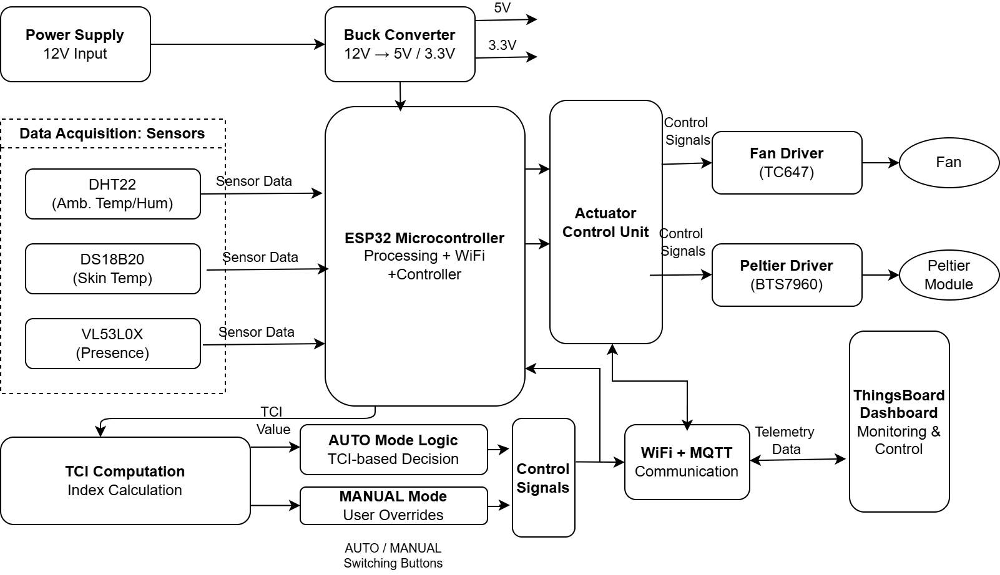
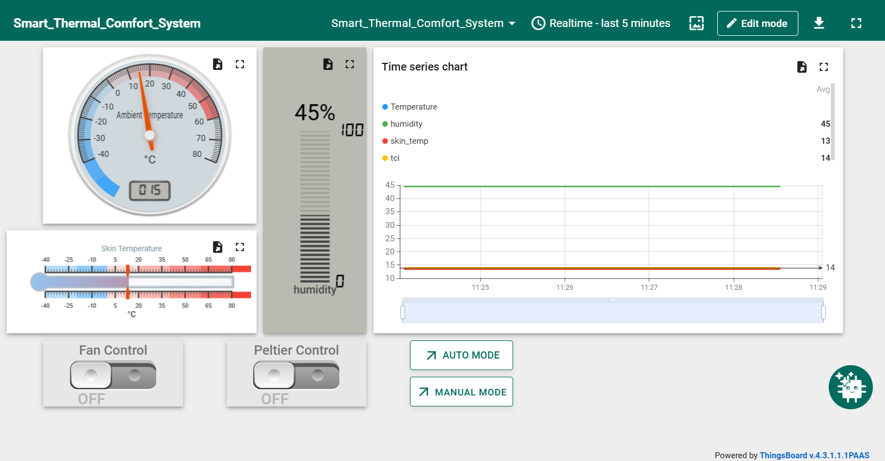
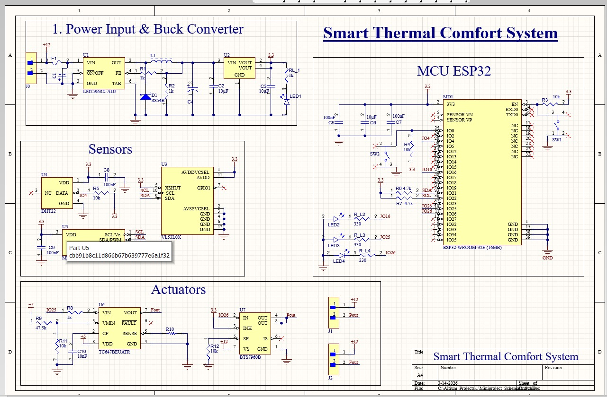
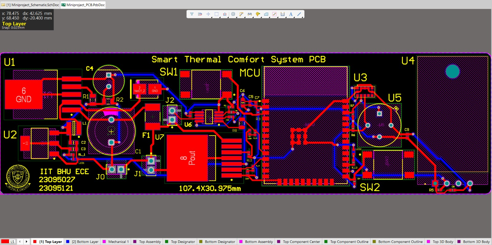
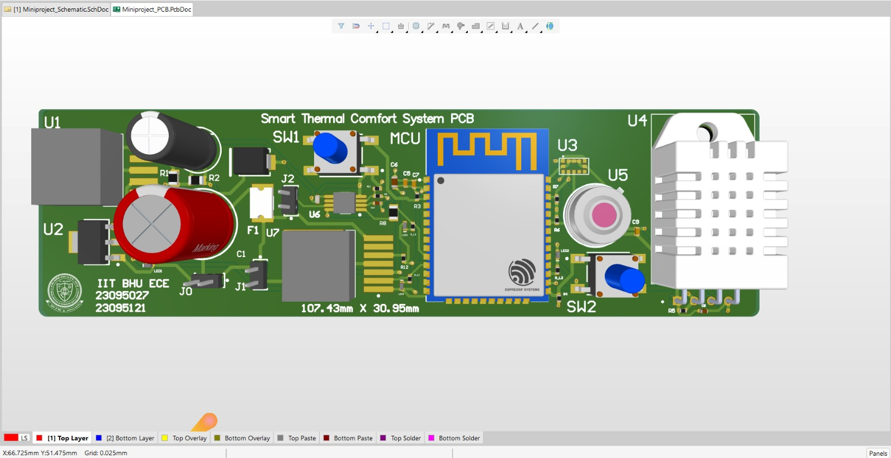
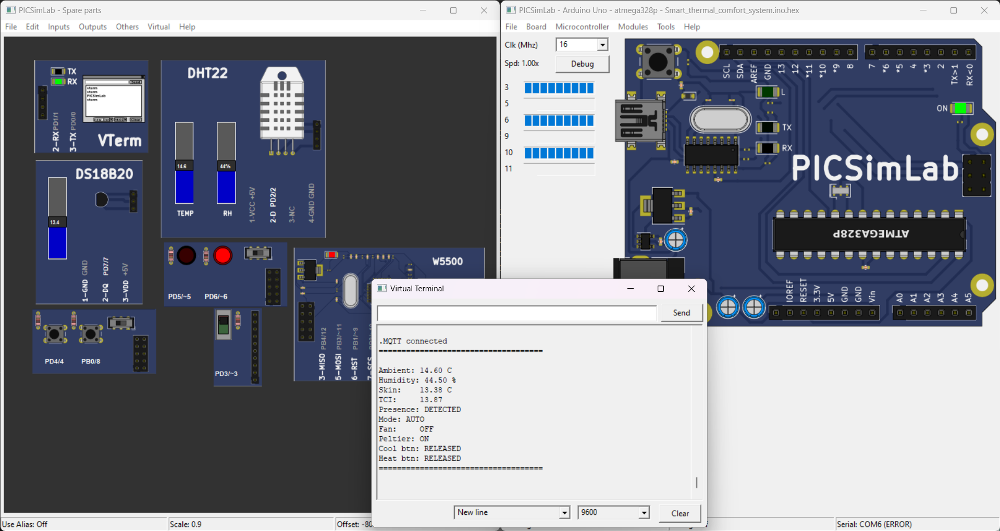

# 🌡️ Smart Thermal Comfort System


<p align="center">
  
  
  
  
  
 
</p>

---

## 📋 Table of Contents

- [Overview](#-overview)
- [Features](#-features)
- [System Architecture](#-system-architecture)
- [Hardware Components](#-hardware-components)
- [Pin Configuration](#-pin-configuration)
- [TCI Formula](#-tci-formula)
- [Firmware Structure](#-firmware-structure)
- [Libraries Required](#-libraries-required)
- [Setup & Installation](#-setup--installation)
- [IoT Dashboard (ThingsBoard)](#-iot-dashboard-thingsboard)
- [PCB Design](#-pcb-design)
- [Simulation Results](#-simulation-results)
- [Project Structure](#-project-structure)


---

## 🔍 Overview

The **Smart Thermal Comfort System** is an ESP32-based embedded system that provides **personalized thermal comfort** by computing a real-time **Thermal Comfort Index (TCI)** from multi-sensor fusion data. Unlike conventional thermostat systems that rely solely on ambient temperature, this system combines:

- **Ambient temperature & humidity** (DHT22)
- **Skin/surface temperature** (DS18B20)
- **Presence detection** (VL53L0X / digital presence pin)

Based on the computed TCI, the system automatically controls a **cooling fan** (TC647 driver) and a **Peltier thermoelectric module** (BTS7960 H-bridge driver) to maintain optimal thermal comfort. All sensor data and actuator states are published in real-time to a **ThingsBoard IoT dashboard** over **Wi-Fi + MQTT**.

---

## ✨ Features

| Feature | Description |
|---|---|
| 🧠 **TCI Computation** | Personalized Thermal Comfort Index from skin temp, ambient temp & humidity |
| 👁️ **Presence Detection** | System activates only when user is detected — saves energy |
| 🤖 **AUTO Mode** | TCI-based autonomous control of fan and Peltier module |
| 🕹️ **MANUAL Mode** | User override via physical buttons or IoT dashboard |
| 📡 **IoT Dashboard** | Real-time monitoring & control via ThingsBoard + MQTT |
| 🔁 **RPC Control** | Remote setMode, setFan, setPeltier commands from dashboard |
| 📟 **Serial Debug** | 5-second periodic debug prints over Serial (9600 baud) |
| ⚡ **Dual Power Rails** | 12V input → LM2596SX Buck Converter → 5V & 3.3V regulated |
| 🖥️ **Custom PCB** | 2-layer compact PCB (107.4 × 30.975 mm) designed in Altium Designer |

---

## 🏗️ System Architecture

<p align="center">
  
</p>

**Control Logic (AUTO Mode):**
```
TCI > +2  →  Fan ON,     Peltier OFF   (Too Hot — Cool Down)
TCI < -2  →  Fan OFF,    Peltier ON    (Too Cold — Heat Up)
-2 ≤ TCI ≤ +2  →  Fan OFF, Peltier OFF  (Comfortable Zone)
Presence = FALSE  →  Fan OFF, Peltier OFF  (No one present)
```

---

## 🔧 Hardware Components

| Component | Part Number | Function | Interface |
|---|---|---|---|
| **Microcontroller** | ESP32-WROOM-32E (16MB) | Main processing, WiFi, control | — |
| **Ambient Sensor** | DHT22 | Temperature (−40 to 80°C) & Humidity (0–100%) | Digital (GPIO2) |
| **Skin Temp Sensor** | DS18B20 | Surface/skin temperature, ±0.5°C | 1-Wire (GPIO7) |
| **Presence Sensor** | VL53L0X / Digital | User presence detection | Digital (GPIO3) |
| **Fan Driver** | TC647BEUATR | PWM-controlled fan driver | PWM (GPIO5) |
| **Peltier Driver** | BTS7960B | H-bridge Peltier driver, 12V/43A | Digital (GPIO6) |
| **Buck Converter** | LM2596SX-ADJ | 12V → 5V & 3.3V regulation | — |
| **Rectifier Diode** | SS54B | Flyback protection | — |
| **Ethernet Module** | W5500 | Network connectivity (simulation) | SPI |
| **Cool Button** | Tactile Switch | Manual cooling trigger | Digital (GPIO4) |
| **Heat Button** | Tactile Switch | Manual heating trigger | Digital (GPIO8) |

---

## 📌 Pin Configuration

```
ESP32 / Arduino Pin Map
──────────────────────────────────────
Pin 2  → DHT22 Data          (Ambient Temp/Humidity)
Pin 3  → Presence Input      (VL53L0X / Digital)
Pin 4  → Button COOL         (Manual Cool — INPUT)
Pin 5  → Fan PWM Output      (TC647 Fan Driver)
Pin 6  → Peltier Output      (BTS7960 H-Bridge)
Pin 7  → DS18B20 Data        (Skin Temp, 1-Wire)
Pin 8  → Button HEAT         (Manual Heat — INPUT)

SPI (W5500 Ethernet for simulation):
Pin 10 → CS
Pin 11 → MOSI
Pin 12 → MISO
Pin 13 → SCK
──────────────────────────────────────
```

---

## 📐 TCI Formula

The **Thermal Comfort Index (TCI)** is computed as:

```
TCI = (skinTemp − 34.0) + 0.5 × (ambientTemp − 24.0) + 1.5 × (humidity / 100.0)
```

| Variable | Description | Baseline |
|---|---|---|
| `skinTemp` | DS18B20 skin/surface temperature (°C) | 34.0°C (neutral skin temp) |
| `ambientTemp` | DHT22 ambient temperature (°C) | 24.0°C (neutral ambient) |
| `humidity` | DHT22 relative humidity (%) | Normalized as fraction |

**Interpretation:**
- **TCI > +2** → Too Hot → Fan ON
- **TCI < −2** → Too Cold → Peltier ON (heating)
- **−2 ≤ TCI ≤ +2** → Comfortable → All actuators OFF

---

## 📁 Firmware Structure

The firmware is written in **Arduino C++** with a modular multi-file architecture:

```
Firmware/
├── Smart_thermal_comfort_system.ino   ← Main entry point (setup + loop)
├── config.h                           ← All pin definitions, MQTT config, timing
├── sensor.h / sensor.cpp              ← DHT22, DS18B20, presence, TCI computation
├── actuators.h / actuators.cpp        ← Fan & Peltier control, AUTO/MANUAL logic
├── network.h / network.cpp            ← MQTT connect, RPC callback, reconnect
├── telemetry.h / telemetry.cpp        ← Periodic JSON telemetry publish to MQTT
└── debug.h / debug.cpp                ← Serial debug print (every 5 seconds)
```

**Main Loop Flow:**
```
loop()
 ├── sensor_update()     → Read DHT22, DS18B20, presence, buttons
 ├── actuator_update()   → Evaluate TCI / manual buttons, drive outputs
 ├── network_loop()      → MQTT keep-alive, reconnect if needed
 ├── telemetry_send()    → Publish JSON to ThingsBoard every 2 seconds
 └── debug_print()       → Serial monitor output every 5 seconds
```

---

## 📚 Libraries Required

Install these via **Arduino IDE → Library Manager** or **PlatformIO**:

| Library | Install Name | Purpose |
|---|---|---|
| DHT sensor library | `DHT sensor library` by Adafruit | DHT22 temperature & humidity |
| Adafruit Unified Sensor | `Adafruit Unified Sensor` | Dependency for DHT |
| OneWire | `OneWire` by Paul Stoffregen | 1-Wire bus for DS18B20 |
| DallasTemperature | `DallasTemperature` by Miles Burton | DS18B20 temperature reading |
| PubSubClient | `PubSubClient` by Nick O'Leary | MQTT client |
| Ethernet | `Ethernet` (built-in) | W5500 Ethernet (simulation) |

---

## ⚙️ Setup & Installation

### 1. Clone the Repository
```bash
git clone https://github.com/brijeshahirwar100/Smart_Thermal_Comfort_System.git
cd Smart-Thermal-Comfort-System
```

### 2. Configure Credentials
Open `Firmware/config.h` and update:

```cpp
// ── MQTT ──────────────────────────────────────────
#define MQTT_SERVER  "mqtt.thingsboard.cloud"
#define TOKEN        "YOUR_THINGSBOARD_DEVICE_TOKEN"   // ← Replace this

// ── SENSOR PINS ───────────────────────────────────
#define DHT_PIN      2
#define DHT_TYPE     DHT22
#define DS18_PIN     7

// ── INPUT PINS ────────────────────────────────────
#define PRESENCE_PIN 3
#define BTN_COOL     4
#define BTN_HEAT     8

// ── OUTPUT PINS ───────────────────────────────────
#define FAN_PIN      5
#define PELTIER_PIN  6

// ── TIMING ────────────────────────────────────────
#define TELEMETRY_INTERVAL 2000   // ms
```


### 3. Install Libraries
In Arduino IDE: **Tools → Manage Libraries** and install all libraries listed above.

### 4. Select Board & Upload
- Board: **ESP32 Dev Module** (or Arduino Uno for simulation)
- Port: Select your COM port
- Upload Speed: 115200
- Click **Upload**

### 5. Monitor Serial Output
Open **Serial Monitor** at **9600 baud**. You should see:
```
.MQTT connected
====================================
Ambient: 14.60 C
Humidity: 44.50 %
Skin:     13.38 C
TCI:      13.87
Presence: DETECTED
Mode: AUTO
Fan:      OFF
Peltier:  ON
Cool btn: RELEASED
Heat btn: RELEASED
====================================
```

---

## 📊 IoT Dashboard (ThingsBoard)

<p align="center">
  
</p>

### Dashboard Widgets
| Widget | Data Key | Description |
|---|---|---|
| Analog Gauge | `ambient_temp` | Real-time ambient temperature |
| Horizontal Slider | `skin_temp` | Real-time skin temperature |
| Vertical Bar | `humidity` | Real-time relative humidity |
| Time-Series Chart | `ambient_temp`, `humidity`, `skin_temp`, `tci` | Historical trend graph |
| Toggle Switch | `setFan` RPC | Manual fan ON/OFF |
| Toggle Switch | `setPeltier` RPC | Manual Peltier ON/OFF |
| Button | `setMode: AUTO` | Switch to AUTO TCI mode |
| Button | `setMode: MANUAL` | Switch to MANUAL override mode |

### MQTT Topics
| Topic | Direction | Description |
|---|---|---|
| `v1/devices/me/telemetry` | Publish | Sensor data & actuator states |
| `v1/devices/me/rpc/request/+` | Subscribe | Receive commands from dashboard |
| `v1/devices/me/rpc/response/{id}` | Publish | Acknowledge RPC commands |

### Setup ThingsBoard
1. Create a free account at [thingsboard.cloud](https://thingsboard.cloud)
2. Add a new **Device**
3. Copy the **Device Access Token**
4. Paste it into `config.h` as `TOKEN`
5. Create a dashboard and add widgets for the keys above

---

## 🖥️ PCB Design

Designed in **Altium Designer** — 2-layer compact PCB.

### PCB Specifications
| Parameter | Value |
|---|---|
| Board Size | 107.4 × 30.975 mm |
| Layers | 2 (Top + Bottom copper) |
| Design Tool | Altium Designer |


### PCB Images


### Schematic
<p align="center">
  
</p>

**Schematic Sections:**
1. **Power Input & Buck Converter** — LM2596SX-ADJ, SS54B diode, filter capacitors
2. **MCU** — ESP32-WROOM-32E (16MB), decoupling caps, mode select switch
3. **Sensors** — DHT22, VL53L0X (I2C with XSHUT), DS18B20 (1-Wire)
4. **Actuators** — TC647BEUATR (fan driver), BTS7960B (Peltier H-bridge)

### 2D Layout 
<p align="center">
  
</p>

### 3D Layout 
<p align="center">
  
</p>


### Gerber Files
Production-ready Gerber files are available in [`PCB_Design/Gerber/`](PCB_Design/Gerber/).

| File | Layer |
|---|---|
| `PCB1_Copper_Signal_Top.gbr` | Top copper layer |
| `PCB1_Copper_Signal_Bot.gbr` | Bottom copper layer |
| `PCB1_Soldermask_Top.gbr` | Top soldermask |
| `PCB1_Soldermask_Bot.gbr` | Bottom soldermask |
| `PCB1_Legend_Top.gbr` | Top silkscreen |
| `PCB1_PTH_Drill.gbr` | Plated through-hole drills |
| `PCB1_NPTH_Drill.gbr` | Non-plated drills |
| `PCB1_Profile.gbr` | Board outline |

---

## 🧪 Simulation Results

Simulated in **PICSimLab** with virtual DHT22, DS18B20, W5500 Ethernet, and MQTT broker.

<p align="center">
  
</p>

### Simulation Output (Virtual Terminal)
```
.MQTT connected
====================================
Ambient: 14.60 C
Humidity: 44.50 %
Skin:     13.38 C
TCI:      13.87
Presence: DETECTED
Mode: AUTO
Fan:      OFF
Peltier:  ON
Cool btn: RELEASED
Heat btn: RELEASED
====================================
```

**Verification:** With TCI = 13.87 (well below −2 threshold... wait — the formula gives negative here):
```
TCI = (13.38 − 34.0) + 0.5 × (14.60 − 24.0) + 1.5 × (44.50/100)
    = (−20.62) + 0.5 × (−9.40) + 1.5 × 0.445
    = −20.62 − 4.70 + 0.6675
    = −24.65  →  TCI << −2  →  Peltier ON ✓
```
**Result confirmed:** AUTO mode correctly activates **Peltier (heating)** when TCI is far below comfort zone. ✅

---

## 📂 Project Structure

```
Smart-Thermal-Comfort-System/
│
├── README.md
│
├── Firmware/
│   ├── Smart_thermal_comfort_system.ino
│   ├── config.h
│   ├── sensor.h
│   ├── sensor.cpp
│   ├── actuators.h
│   ├── actuators.cpp
│   ├── network.h
│   ├── network.cpp
│   ├── telemetry.h
│   ├── telemetry.cpp
│   ├── debug.h
│   └── debug.cpp
│
├── PCB_Design/
│   ├── Smart_thermal_comfort_system_PCB_Schematics.jpeg
│   ├── Smart_thermal_comfort_system_PCB_Layout.jpeg
│   ├── Smart_thermal_comfort_system_PCB_3D.jpeg
│   └── Gerber/
│       ├── PCB1_Copper_Signal_Top.gbr
│       ├── PCB1_Copper_Signal_Bot.gbr
│       ├── PCB1_Soldermask_Top.gbr
│       ├── PCB1_Soldermask_Bot.gbr
│       ├── PCB1_Legend_Top.gbr
│       ├── PCB1_Legend_Bot.gbr
│       ├── PCB1_PTH_Drill.gbr
│       ├── PCB1_NPTH_Drill.gbr
│       ├── PCB1_Profile.gbr
│       └── PCB1.apr
│
├── Block_Diagram/
│   └── block_diagram.png
│
├── Simulation/
│   └── PICSIMLAB_Working_Simulation.png
│
├── Dashboard/
│   └── smart_thermal_comfort_system_Dashboard.png
│
└── Presentation/
    └── MINI_PROJECT_EC-323_EMBEDDED_SYSTEM_DESIGN.pptx
```

---

##  Owner

**Brijesh Ahirwar**
B.Tech, Electronics & Communication Engineering
IIT (BHU) Varanasi

---

## 📄 License

This project is licensed under the **MIT License** — feel free to use,
modify, and distribute with proper credit to the original authors.

---


 
